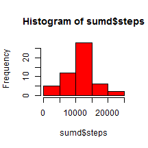
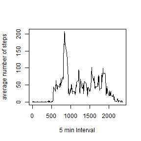
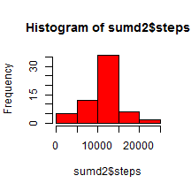
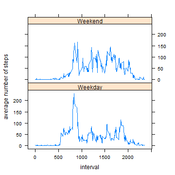

Analyzing FitBit Data
==============================

This R Markdown steps through different parts of assignment 1
Before the code can be run, make sure that the data file and the Rmd file are in the same folder

#Objectives

in this report the activity level during 5 minute intervals for two months of October and November of 2012 will be carefully analyzed.

#Methodology
### 1. reading and formatting the data
The data will be read into a data frame and the date format will be converted from factor to date class.


```r
act <- read.csv("activity.csv")
act <- transform(act, date = as.Date(as.character(date, "%Y-%m-%d")))
```

### 2. calculating mean and median of total steps per day
In order to calculate mean for each day, the "tapply" function will be used as follows:


```r
#sumd <- tapply(act$steps, act$date, sum)
sumd <- aggregate(steps~date, data=act, FUN = sum)
hist(sumd$steps, col = "red")
```



```r
mn <- mean(sumd$steps, na.rm = T)
md <- median(sumd$steps, na.rm = T)
```

* The mean of total number of steps per day is 1.0766189 &times; 10<sup>4</sup> and the median is 10765.

### 3. calculating mean and median of total steps per 5-min interval

In this step, "tapply" function is used again:


```r
#mean5 <- tapply(act$steps, act$interval, mean, na.rm=T)
mean5 <- aggregate(steps~interval, data=act, FUN=mean)
plot(y=mean5$steps, x=mean5$interval, type = "l", xlab = "5 min Interval", ylab = "average number of steps")
```



```r
max5    <- max(mean5$steps)
max5int <- mean5$interval[which.max(mean5$steps)]
```

Maximum average number of steps is 206.1698113 and occurs during interval 835

### 4. Calculating the number of missing values

In this part, the number of NA values are counted and missing values are substituted with the average values.


```r
nas <- sum(is.na(act$steps))
act2 <- act
act2$steps <- ifelse(is.na(act2$steps) == TRUE, mean5$steps[mean5$interval %in% act2$interval], act2$steps)

#act$steps[is.na(act$steps)] <- mean5$steps[match(act$interval[is.na(act$steps)],mean5$interval)]

sumd2 <- aggregate(steps~date, data=act2, FUN = sum)
hist(sumd2$steps, col = "red")
```



```r
mn2 <- mean(sumd2$steps, na.rm = T)
md2 <- median(sumd2$steps, na.rm = T)

mndiff <- mn2-mn
mddiff <- md2-md
```

* There are 2304 NAs in the dateset.
* The mean of total number of steps per day in the imputed dataset is 1.0766189 &times; 10<sup>4</sup> and the median is 1.0766189 &times; 10<sup>4</sup>.
* The mean has not changed (diff = 0) but the median has changed by 1.1886792
* Imputing the missing values will increase the estimates of total daily number of steps.

### 5. comparing weekday and weekend activities

In this part, the activity levels between weekdays and weekends will be compared.


```r
act2$day <- ifelse(weekdays(act$date) %in% c("Saturday", "Sunday"), "Weekend", "Weekday")
library(lattice)
mean52 <- aggregate(steps~interval+day, data=act2, FUN=mean)
with(mean52, xyplot(steps~interval|day, type="l", layout=c(1,2), ylab="average number of steps"))
```


